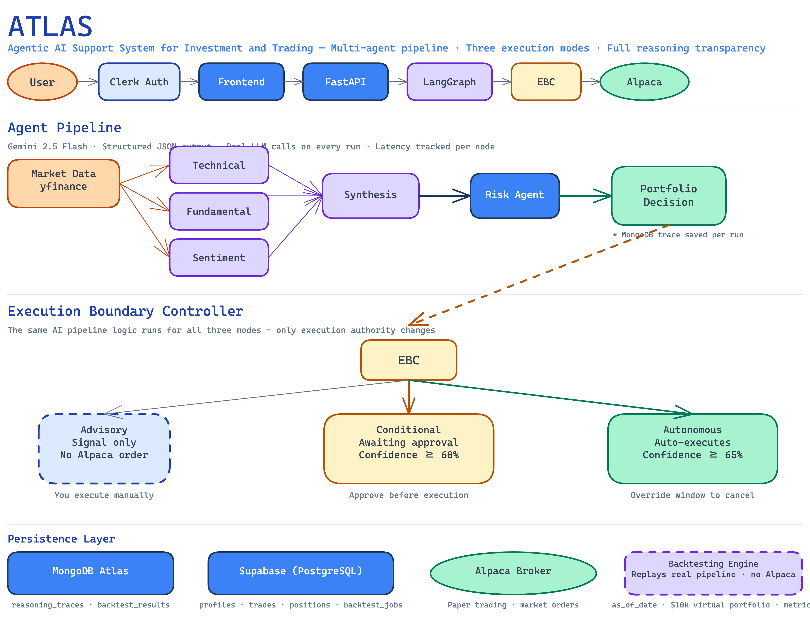

# Atlas

> Agentic AI Support System for Investment and Trading

Atlas is a multi-agent AI trading assistant that runs a full analysis pipeline on any stock ticker and lets you control how much authority the AI has over trade execution — from pure signals to fully autonomous trading.



## What Makes Atlas Different

Most retail AI trading tools are black boxes. Atlas shows its reasoning at every step and lets you set the execution boundary:

| Mode | Behaviour |
|------|-----------|
| **Advisory** | AI generates signals — you execute manually. Full reasoning on every signal. |
| **Autonomous** | AI executes automatically within your risk limits. 5-minute override window on every trade. |

The trading logic is identical across both modes. Only the execution authority changes.

## What's Built

### Agent Pipeline — fully operational

A LangGraph `StateGraph` runs three analysts in parallel, then fans in to synthesis, risk, and a final portfolio decision:

```
Market Data (yfinance: OHLCV, fundamentals, news)
    ↓
[Technical | Fundamental | Sentiment]  ← parallel
    ↓ fan-in
Synthesis → Risk → Portfolio Decision
    ↓
MongoDB Atlas  (full reasoning trace saved per run)
    ↓
Execution Boundary Controller → Broker (Alpaca paper)
```

All analyst and decision nodes are real implementations — no stubs. The risk agent is deterministic (2% portfolio risk rule, 2:1 R/R). All LLM calls use Gemini 2.5 Flash with structured JSON output.

### Execution Boundary Controller — fully operational

Three modes with confidence thresholds (60% conditional, 65% autonomous). Advisory returns the signal only; Conditional marks it `awaiting_approval` until the user approves; Autonomous executes immediately and opens an override window.

### Authentication — Clerk JWT

Login at `/login` via Clerk. The backend validates every request with `ClerkAuthMiddleware`, verifying JWTs against the instance-specific JWKS endpoint. Unauthenticated requests return `401`.

### Backend API — fully live

| Endpoint | Status | Description |
|----------|--------|-------------|
| `GET /health` | ✅ Live | Health check — returns status, version, env |
| `POST /v1/pipeline/run` | ✅ Live | Full pipeline execution |
| `GET /v1/portfolio` | ✅ Live | Real Alpaca account data |
| `GET /v1/signals` | ✅ Live | Recent signals from MongoDB traces |
| `POST /v1/signals/{id}/approve` | ✅ Live | Places Alpaca order, idempotent |
| `POST /v1/signals/{id}/reject` | ✅ Live | Persists rejection to MongoDB trace |
| `GET /v1/trades` | ✅ Live | Trade history from Supabase |
| `POST /v1/trades/{id}/override` | ✅ Live | Cancels Alpaca order, writes to `override_log` |
| `POST /v1/backtest` | ✅ Live | Create backtest job — real Gemini pipeline, async |
| `GET /v1/backtest` | ✅ Live | List backtest jobs for user |
| `GET /v1/backtest/{id}` | ✅ Live | Job status + full results (polling target) |
| `DELETE /v1/backtest/{id}` | ✅ Live | Delete job + MongoDB results |

### Backtesting Engine — fully operational

Replays the real AI pipeline (live Gemini calls) across historical date ranges and multiple tickers. Simulates trade execution in a virtual portfolio without touching Alpaca. Results persisted to Supabase (metadata) and MongoDB (full daily runs, equity curve, metrics).

Key design decisions:
- `as_of_date` constrains yfinance price/fundamental data to the historical date — no look-ahead bias
- $10,000 shared capital pool across all tickers; $1,000 notional per trade
- Confidence thresholds mirror live EBC config (conditional ≥ 60%, autonomous ≥ 65%)
- Advisory mode produces signals only — no trades, total_trades always 0

Metrics computed: cumulative return, Sharpe ratio (annualised, risk-free=0), max drawdown, win rate, signal-to-execution rate, per-ticker return contribution.

### Frontend Dashboard — authenticated

Six pages: landing (`/`), pricing (`/pricing`), login (`/login`), user dashboard (`/dashboard`, 5 tabs), admin panel (`/admin`), and design system (`/design-system`). Auth gated via Clerk. Light theme throughout; manual dark mode toggle. Login is mobile-first with Google OAuth only. Pricing page shows Free/Pro/Max tiers with annual/monthly toggle and feature comparison table.

### Databases — both active

- **MongoDB Atlas** — `reasoning_traces` collection: every pipeline run writes a full trace. Powers the signals list.
- **Supabase (PostgreSQL)** — All 5 tables active with RLS: `profiles` (stores `boundary_mode`), `portfolios`, `positions`, `trades`, `override_log`.

## Monorepo Structure

| Folder | Deploys to | Purpose |
|--------|-----------|---------|
| [`frontend/`](./frontend/) | Vercel (UAT) | Next.js 16 dashboard |
| [`backend/`](./backend/) | Render (UAT) | FastAPI REST API |
| [`agents/`](./agents/) | Imported by backend | LangGraph pipeline |
| [`database/`](./database/) | Supabase + MongoDB Atlas | Schema definitions |
| [`docs/`](./docs/) | — | Architecture and context |

## Quick Start

```bash
# Backend
cd backend && uv sync && cp .env.example .env
uv run uvicorn main:app --reload   # → http://localhost:8000

# Frontend
cd frontend && npm install && cp .env.example .env.local
npm run dev                        # → http://localhost:3000
```

Run the pipeline directly:

```bash
curl -X POST http://localhost:8000/v1/pipeline/run \
  -H "Content-Type: application/json" \
  -H "Authorization: Bearer <clerk-jwt>" \
  -d '{"ticker": "AAPL", "boundary_mode": "conditional"}'
```

## Tech Stack

- **Frontend** — Next.js 16, TypeScript, Tailwind CSS v4, Clerk
- **Backend** — FastAPI, Python 3.11+, uv, Docker (Render)
- **Agents** — LangGraph, Google Gemini 2.5 Flash (`google-genai`), yfinance
- **Databases** — Supabase (PostgreSQL + RLS) + MongoDB Atlas (reasoning traces)
- **Auth** — Clerk (frontend session + JWT) + ClerkAuthMiddleware (backend verification)
- **Broker** — Alpaca paper trading (connected); IBKR planned for production

## UAT Deployments

| Service | URL |
|---------|-----|
| Backend | `https://atlas-broker-backend-uat.onrender.com` |
| Frontend | `https://atlas-broker-frontend-uat.vercel.app` |

---

## Academic Context

Capstone project BAC3004 at Singapore Institute of Technology (Applied Computing Fintech).
- Interim report: 12 April 2026
- Final report: 19 July 2026
