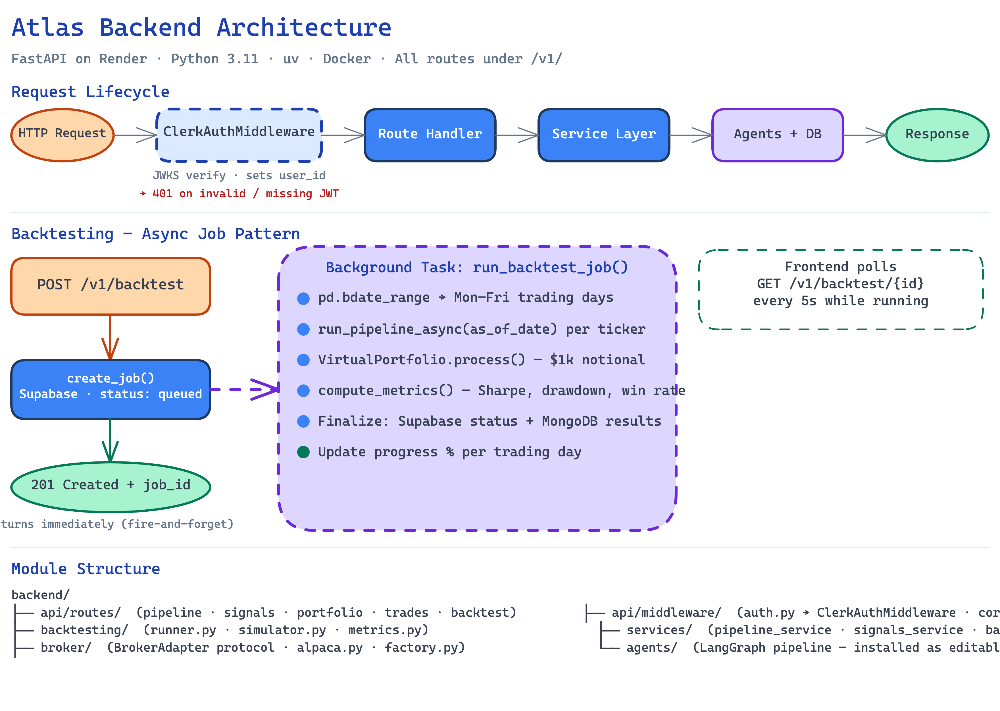

# Atlas — Backend

FastAPI REST API for the Atlas AI trading assistant. Deployed on Render (UAT) via Docker.



## Stack

- **Framework** — FastAPI 0.115+
- **Language** — Python 3.11+
- **Package manager** — uv
- **Runtime** — Uvicorn (ASGI)
- **Containerisation** — Docker
- **Deployment** — Render (UAT)

## Structure

```
backend/
├── main.py                        # App entry point — mounts routers, middleware, keep-alive task, scheduler
├── api/
│   ├── middleware/
│   │   ├── auth.py                # ClerkAuthMiddleware — JWT verification via JWKS
│   │   └── cors.py                # CORS config (auto-includes localhost in dev)
│   └── routes/
│       ├── pipeline.py            # POST /v1/pipeline/run — full live pipeline
│       ├── signals.py             # GET /v1/signals, POST approve/reject
│       ├── portfolio.py           # GET /v1/portfolio, GET equity-curve, GET positions/{ticker}/log
│       ├── trades.py              # GET /v1/trades, POST /v1/trades/{id}/override
│       ├── watchlist.py           # GET/PUT /v1/watchlist — per-user watchlist with schedule
│       ├── backtest.py            # POST/GET/DELETE /v1/backtest — backtest job management
│       ├── scheduler.py           # GET /v1/scheduler/status
│       ├── profile.py             # GET/PATCH /v1/profile
│       └── admin.py               # GET/PATCH /v1/admin/* — role-gated admin endpoints
├── broker/
│   ├── base.py                    # BrokerAdapter Protocol (place_order, cancel_order, get_open_orders, get_account, get_positions)
│   ├── alpaca.py                  # AlpacaAdapter — paper trading
│   └── factory.py                 # get_broker_for_user() (Supabase credentials) + get_broker() (env fallback)
├── boundary/
│   ├── modes.py                   # BoundaryMode enum + per-mode confidence thresholds
│   └── controller.py              # ExecutionBoundaryController.execute() — cancels stale orders before autonomous runs
├── db/
│   └── supabase.py                # Supabase client — trades, positions, profiles, override_log
├── backtesting/
│   ├── __init__.py
│   ├── runner.py                  # Background task: orchestrates backtest run + checkpoint/resume
│   ├── simulator.py               # VirtualPortfolio — cash, positions, P&L simulation
│   └── metrics.py                 # Sharpe, drawdown, win rate, signal-to-execution rate
├── scheduler/
│   └── runner.py                  # Multi-window scheduler loop + per-user watchlist dispatch
└── services/
    ├── pipeline_service.py        # run_pipeline_with_ebc — agents → EBC → response; cancels stale orders
    ├── signals_service.py         # MongoDB queries; approve-and-execute with idempotency guard
    ├── backtest_service.py        # Backtest job CRUD (Supabase) + results persistence + checkpoint (MongoDB)
    ├── watchlist_service.py       # SCHEDULE_WINDOWS mapping, get/save watchlist, get_tickers_for_window
    └── notification_service.py   # Resend email — low-confidence signal alerts
```

`atlas-agents` (the `agents/` package) is installed as a local editable dependency.

## Authentication

All routes except `/health` and `/webhooks/clerk` require a valid Clerk JWT.

`ClerkAuthMiddleware` (`api/middleware/auth.py`):
- Extracts `Authorization: Bearer <token>` from every request
- Verifies the JWT against the instance-specific Clerk JWKS endpoint
- Sets `request.state.user_id` to the `sub` claim on success
- Returns `401` on missing or invalid tokens; `503` if JWKS is unreachable
- Passes `OPTIONS` requests through for CORS preflight

The JWKS URL is derived automatically from `CLERK_PUBLISHABLE_KEY` (decodes the base64 instance domain). Set `CLERK_JWKS_URL` explicitly to override.

## API Routes

| Method | Path | Description |
|--------|------|-------------|
| `GET` | `/health` | Health check — returns status, version, env |
| `POST` | `/v1/pipeline/run` | Runs the full agent pipeline for a ticker |
| `GET` | `/v1/signals` | Fetches recent signals from MongoDB reasoning traces. Each signal includes `shares` and `price` (from risk analysis), and `executed` flag. Executed signals have shares/price overridden with actual Supabase trade data. |
| `POST` | `/v1/signals/{id}/approve` | Places Alpaca order; marks trace as executed (idempotent) |
| `POST` | `/v1/signals/{id}/reject` | Persists rejection to MongoDB trace |
| `GET` | `/v1/portfolio` | Returns live equity, cash, and positions from Alpaca |
| `GET` | `/v1/portfolio/equity-curve` | Historical equity curve from Alpaca portfolio history API |
| `GET` | `/v1/portfolio/positions/{ticker}/log` | Decision log for a ticker from MongoDB. Each entry includes `executed`, `shares`, and `price` fields — sourced from risk analysis, overridden with Supabase trade data for executed signals. |
| `GET` | `/v1/trades` | Returns trade history from Supabase |
| `POST` | `/v1/trades/{id}/override` | Cancels Alpaca order; writes to Supabase `override_log` |
| `GET` | `/v1/watchlist` | Returns user's watchlist with schedule codes |
| `PUT` | `/v1/watchlist` | Replaces user's watchlist (validates ticker + schedule) |
| `POST` | `/v1/backtest` | Create backtest job + start background task |
| `GET` | `/v1/backtest` | List all backtest jobs for user |
| `GET` | `/v1/backtest/{id}` | Job status + full results (polling target) |
| `DELETE` | `/v1/backtest/{id}` | Delete job + MongoDB document |
| `POST` | `/v1/backtest/{id}/cancel` | Cancel a running or queued job |
| `POST` | `/v1/backtest/{id}/resume` | Resume a failed/cancelled job from its last checkpoint |
| `GET` | `/v1/scheduler/status` | Scheduler state + next scan window ET |
| `GET` | `/v1/profile` | Returns current user's profile |
| `PATCH` | `/v1/profile` | Updates boundary_mode / philosophy / display_name |
| `GET` | `/v1/admin/stats` | Platform stats (admin+) |
| `GET` | `/v1/admin/users` | All users (admin+) |
| `PATCH` | `/v1/admin/users/{id}/tier` | Update user tier (superadmin) |
| `PATCH` | `/v1/admin/users/{id}/role` | Update user role (superadmin) |
| `GET` | `/v1/admin/system-status` | Live health check for all services (admin+) |

### Run the Pipeline

```bash
curl -X POST http://localhost:8000/v1/pipeline/run \
  -H "Content-Type: application/json" \
  -H "Authorization: Bearer <clerk-jwt>" \
  -d '{"ticker": "AAPL", "boundary_mode": "conditional"}'
```

Returns action, confidence, reasoning, risk parameters (stop-loss, take-profit, position size, R/R ratio), and a MongoDB trace ID.

## Environment Variables

| Variable | Required | Description |
|----------|----------|-------------|
| `PORT` | No | Server port (default: `8000`) |
| `ENVIRONMENT` | No | `dev` / `development` or `production` — dev auto-adds localhost to CORS |
| `CORS_ORIGINS` | No | Comma-separated allowed origins |
| `CLERK_PUBLISHABLE_KEY` | Yes* | Used to auto-derive JWKS URL |
| `CLERK_JWKS_URL` | Yes* | Instance JWKS endpoint — overrides auto-derivation |
| `CLERK_SECRET_KEY` | No | Clerk secret (used for webhook verification) |
| `CLERK_WEBHOOK_SECRET` | No | Webhook signing secret |
| `SUPABASE_URL` | Yes | Supabase project URL |
| `SUPABASE_ANON_KEY` | Yes | Supabase anon key |
| `SUPABASE_SERVICE_KEY` | Yes | Supabase service role key — never expose to frontend |
| `MONGODB_URI` | Yes | MongoDB Atlas connection string |
| `MONGODB_DB_NAME` | No | Database name (default: `atlas`) |
| `GEMINI_API_KEY` | Yes | Google Gemini API key |
| `LLM_QUICK_MODEL` | No | Fast model (default: `gemini-2.5-flash`) |
| `LLM_DEEP_MODEL` | No | Deep model (default: `gemini-2.5-flash`) |
| `ALPACA_API_KEY` | Yes | Alpaca API key |
| `ALPACA_SECRET_KEY` | Yes | Alpaca secret key |
| `BROKER_TYPE` | No | `alpaca` (default) — future: `ibkr` |
| `SCHEDULER_TICKERS` | No | Fallback tickers for scheduled runs when watchlist is empty |
| `SCHEDULER_EBC_MODE` | No | Override boundary mode for all scheduled runs |
| `SCHEDULER_USER_ID` | No | Clerk user_id to attribute scheduled runs to (fallback single-user mode) |
| `RENDER_EXTERNAL_URL` | Auto | Set by Render — used by the keep-alive ping task |
| `RESEND_API_KEY` | No | Resend API key — required for email notifications |

*Either `CLERK_PUBLISHABLE_KEY` or `CLERK_JWKS_URL` must be set for auth to work.

## Getting Started

```bash
uv sync
cp .env.example .env
uv run uvicorn main:app --reload   # → http://localhost:8000
```

Swagger UI at `http://localhost:8000/docs` (available in development mode).

## Docker

```bash
docker build -t atlas-backend .
docker run -p 8000:8000 --env-file .env atlas-backend
```

## Deployment (Render)

1. New Web Service → connect repo → set root directory to `backend/`
2. Runtime: **Docker** (Render detects the Dockerfile automatically)
3. Add all env vars from `.env.example`
4. `RENDER_EXTERNAL_URL` is injected by Render; the keep-alive task uses it to prevent free-tier sleep

UAT: `https://atlas-broker-backend-uat.onrender.com`

## Commands

```bash
uv sync                              # install all dependencies
uv sync --no-dev                     # production install
uv run uvicorn main:app --reload     # dev server
uv run pytest                        # run tests
uv add <package>                     # add a dependency
```
