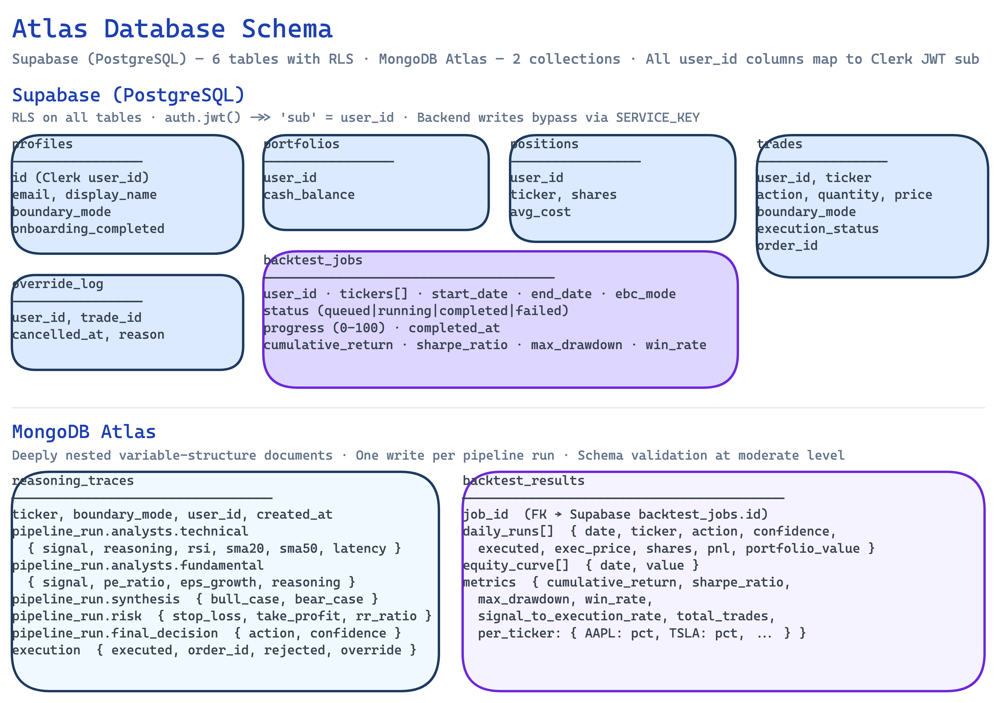

# Atlas — Database

Schema definitions for both databases. Neither requires manual GUI steps — both are managed via CLI.



## Databases

### Supabase (PostgreSQL)

Relational data with Row Level Security enforced on every table. Every table has a `user_id` column — multi-tenancy ready, tied to Clerk user IDs.

| Table | Description | Status |
|-------|-------------|--------|
| `profiles` | One row per user — stores `boundary_mode`, `investment_philosophy`, `tier`, `role`, `display_name` | ✅ Active |
| `portfolios` | Paper portfolio record — tracks cash balance | ✅ Active |
| `positions` | Open positions — ticker, shares, average cost. Synced from Alpaca on trade execution | ✅ Active |
| `trades` | Trade history — action, quantity, price, execution status, boundary mode used | ✅ Active |
| `override_log` | Audit trail of user overrides in Autonomous mode | ✅ Active |
| `backtest_jobs` | Backtest job metadata — status, tickers, date range, EBC mode, summary metrics, progress, mongo_id | ✅ Active |
| `watchlist` | Per-user ticker watchlist with scan frequency (`1x`/`3x`/`6x`); `UNIQUE(user_id, ticker)` | ✅ Active |

RLS policies use `auth.jwt() ->> 'sub'` to match Clerk user IDs (not Supabase's native `auth.uid()`). Frontend sends a Clerk JWT (from the `atlas-supabase` template) as the `Authorization` header. Backend writes use `SUPABASE_SERVICE_KEY` which bypasses RLS natively.

**Deploy the schema:**

```bash
supabase link --project-ref qbbbuebbxueqclkrvoos
supabase db push
```

Migrations live in `supabase/supabase/migrations/`:

| Migration | Description |
|-----------|-------------|
| `20260313054120_initial_schema.sql` | Creates all 5 tables with initial permissive RLS |
| `20260317100000_user_scoped_rls.sql` | Replaces permissive policies with Clerk JWT-scoped user policies |
| `20260319120000_backtest_jobs.sql` | Creates `backtest_jobs` table with user-scoped RLS |
| `20260405100000_watchlist_table.sql` | Creates `watchlist` table with `UNIQUE(user_id, ticker)` and user-scoped RLS |

### MongoDB Atlas

Two collections in the `atlas` database.

#### `reasoning_traces`

Agent reasoning traces — deeply nested documents with variable structure per pipeline run.

**Schema definition:** `mongo/schemas/reasoning_trace.json`

Each document captures the full pipeline run for a single ticker:

| Field path | Contents |
|-----------|----------|
| `ticker`, `boundary_mode`, `created_at` | Run metadata |
| `user_id` | Clerk user ID of the requesting user |
| `pipeline_run.analysts.technical` | RSI, SMAs, signal, reasoning, latency |
| `pipeline_run.analysts.fundamental` | P/E, growth, signal, reasoning, latency |
| `pipeline_run.analysts.sentiment` | Headline themes, score, reasoning, latency |
| `pipeline_run.synthesis` | Bull case, bear case, verdict |
| `pipeline_run.risk` | Stop-loss, take-profit, position size, position value, R/R ratio |
| `pipeline_run.final_decision` | action, confidence, reasoning |
| `execution` | `executed`, `order_id`, `rejected`, `override` flags |

JSON Schema validation is active at `moderate` level — invalid documents are flagged but not rejected.

**Indexes:**

| Index | Purpose |
|-------|---------|
| `{ user_id: 1, created_at: -1 }` | User's trace history |
| `{ ticker: 1, created_at: -1 }` | Traces by stock |
| `{ "pipeline_run.final_decision.action": 1 }` | Filter by BUY / SELL / HOLD |

#### `backtest_results`

Full backtest results — one document per job. Stores daily pipeline runs, equity curve, checkpoint state, and computed metrics.

| Field | Contents |
|-------|----------|
| `job_id` | UUID matching the Supabase `backtest_jobs` row |
| `daily_runs` | Array of per-day, per-ticker records: action, confidence, executed, price, shares, portfolio value after |
| `equity_curve` | Array of `{ date, value, cash }` — total portfolio value at end of each trading day |
| `metrics` | Cumulative return, Sharpe ratio, max drawdown, win rate, signal-to-execution rate, per-ticker contribution |
| `checkpoint` | `{ last_completed_day, cash, positions }` — saved after each day; used to resume failed/cancelled jobs |

## Directory Structure

```
database/
├── supabase/
│   ├── schema.sql                                       # Canonical schema reference
│   └── supabase/
│       └── migrations/
│           ├── 20260313054120_initial_schema.sql        # Tables + initial RLS
│           ├── 20260317100000_user_scoped_rls.sql       # User-scoped Clerk JWT policies
│           ├── 20260319120000_backtest_jobs.sql         # backtest_jobs table + RLS
│           └── 20260405100000_watchlist_table.sql       # watchlist table + RLS
└── mongo/
    └── schemas/
        └── reasoning_trace.json                         # JSON Schema for trace documents
```
