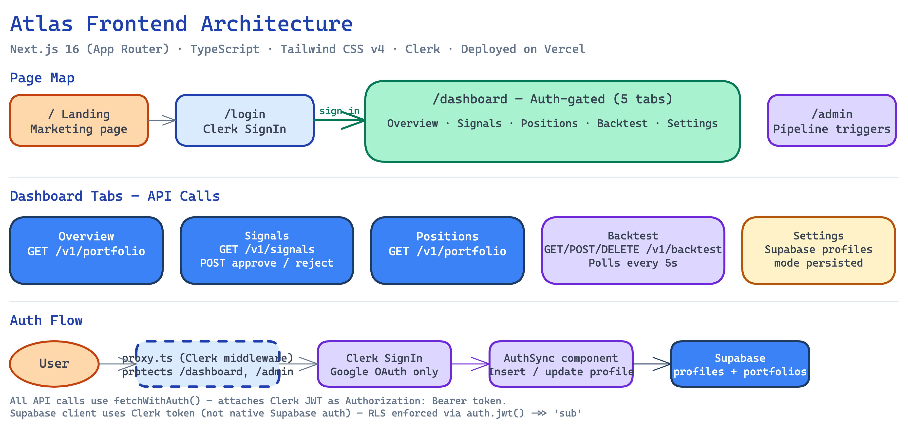

# Atlas — Frontend

Next.js 16 dashboard for the Atlas AI trading assistant. Deployed on Vercel (UAT).



## Stack

- **Framework** — Next.js 16 (App Router)
- **Language** — TypeScript
- **Styling** — Tailwind CSS v4 + CSS custom properties (semantic colour tokens)
- **Fonts** — Syne (headings), JetBrains Mono (financial data), Nunito Sans (body)
- **Auth** — Clerk (`@clerk/nextjs`) — session management, JWT, sign-in UI
- **Theme** — Light by default; manual dark mode toggle via `ThemeProvider`

## Pages

### `/` — Landing
Mobile-first marketing page. Ticker tape animation, execution mode explainer (advisory / conditional / autonomous), CTA to sign in.

### `/login` — Authentication
Light-theme, mobile-first Clerk sign-in. Desktop: split-screen — left panel shows an animated signal preview table; right panel has the Clerk `<SignIn />` widget. Mobile: single centered column. Google OAuth only; the email/password form and divider are hidden via Clerk appearance API. `position: fixed; inset: 0` on the root element bypasses Next.js App Router's height propagation issues.

### `/dashboard` — User Dashboard
Auth-gated. Five-tab layout. Calls live backend APIs on mount. All requests include a Clerk JWT via `Authorization: Bearer <token>`.

| Tab | What it shows | API call |
|-----|---------------|----------|
| Overview | Portfolio summary, latest signal, open positions snapshot | `/v1/portfolio` |
| Signals | Signal list with confidence bars, risk params, approve/reject buttons | `/v1/signals` |
| Positions | Open positions table with unrealised P&L | `/v1/portfolio` |
| Backtest | Job list with progress bars, new job form, results detail with equity curve | `/v1/backtest` |
| Settings | Theme toggle, execution mode selector (persisted to Supabase `profiles`) | — |

Signal approval calls `POST /v1/signals/{id}/approve` and re-fetches. Signal rejection calls `POST /v1/signals/{id}/reject`.

### `/admin` — Admin Panel
Desktop-first sidebar. Manual pipeline triggers, system status, env config display.

### `/design-system` — Component Library
Living styleguide: colour tokens, typography scale, spacing, all button variants and states, badges, cards, signal rows, motion specs, and responsive breakpoints.

## Components

| Component | Purpose |
|-----------|---------|
| `components/ThemeProvider.tsx` | Context provider — exposes `theme` + `toggleTheme`; applies `data-theme` to `<html>` |
| `components/AuthSync.tsx` | Supabase user lifecycle sync — runs on every sign-in; inserts or updates profile + portfolio |

## Auth Flow

1. Unauthenticated users hitting `/dashboard` or `/admin` are redirected to `/login` by `proxy.ts` (Clerk middleware).
2. After sign-in, Clerk redirects to `/dashboard`.
3. `lib/auth.ts` exports `getClerkToken()` — retrieves the current Clerk session JWT.
4. `lib/api.ts` exports `fetchWithAuth()` — wraps `fetch()` with `Authorization: Bearer <token>` and handles network errors gracefully.
5. `AuthSync` (mounted in root layout) requests a Clerk JWT using the `atlas-supabase` template and syncs the user's profile and portfolio to Supabase on sign-in. INSERT on first login; UPDATE identity fields only on conflict.

## Supabase Client (Frontend)

`lib/supabase.ts` exports `createSupabaseClient(clerkToken)` — creates a `@supabase/supabase-js` client with `Authorization: Bearer <clerk-token>` in global headers. RLS policies use `auth.jwt() ->> 'sub'` to scope rows to the authenticated user. Session persistence is disabled (Clerk owns the session).

## Environment Variables

| Variable | Description |
|----------|-------------|
| `NEXT_PUBLIC_API_URL` | Backend API base URL |
| `NEXT_PUBLIC_CLERK_PUBLISHABLE_KEY` | Clerk publishable key |
| `CLERK_SECRET_KEY` | Clerk secret key (server-only) |
| `NEXT_PUBLIC_CLERK_SIGN_IN_URL` | `/login` |
| `NEXT_PUBLIC_CLERK_SIGN_UP_URL` | `/login` |
| `NEXT_PUBLIC_CLERK_SIGN_IN_FALLBACK_REDIRECT_URL` | `/dashboard` |
| `NEXT_PUBLIC_CLERK_SIGN_UP_FALLBACK_REDIRECT_URL` | `/dashboard` |
| `NEXT_PUBLIC_SUPABASE_URL` | Supabase project URL |
| `NEXT_PUBLIC_SUPABASE_ANON_KEY` | Supabase anon key (RLS enforced) |

> Never set `SUPABASE_SERVICE_KEY` in the frontend — it is backend-only.

## Commands

```bash
npm install
cp .env.example .env.local
npm run dev      # → http://localhost:3000
npm run build    # production build
npm run lint     # ESLint
npm test         # Jest unit tests
```

## Deployment

Connect to Vercel, set root directory to `frontend/`, add env vars in the Vercel dashboard. `NEXT_PUBLIC_API_URL` must point to the deployed backend.

UAT: `https://atlas-broker-frontend-uat.vercel.app`
